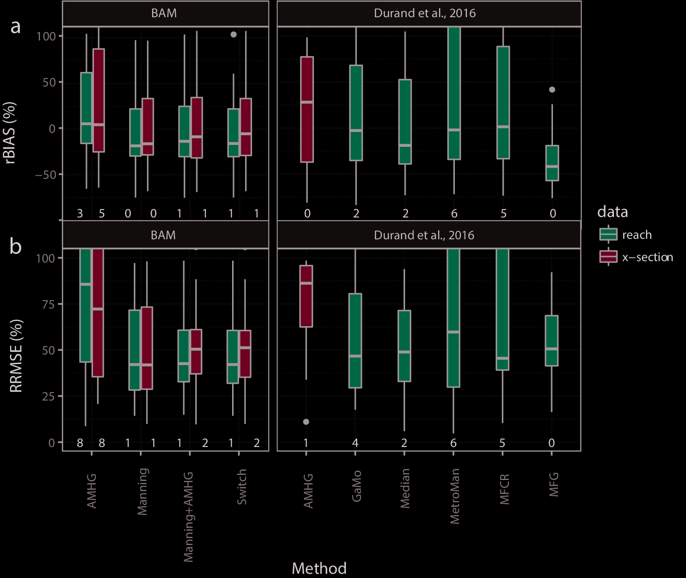

```{r setup, include=FALSE}
library(knitr)
opts_chunk$set(echo = FALSE, message = FALSE, cache = TRUE, 
               fig.width = 6, fig.height = 4,
               warning = FALSE)
opts_knit$set(root.dir = "../../")
```

```{r, echo = FALSE}
library(ProjectTemplate)
getwd()
load.project()

mytheme <- theme_dark() + theme(plot.background = element_rect(fill = "#a0a0a0"))
theme_set(mytheme)
```


## Pepsi 1 results

- Pepsi challenge inversions were far from perfect



## Pepsi 1 challenge

- Given swot-like "observations" along a river
    - $W_{st}, S_{st}, H_{st}$, s indexes space; t indexes time
- estimate flow-law parameters
- predict $Q_t$

```{r}
sac <- reachdata$SacramentoDownstream
swot_plot(sac, vars = c("W", "S", "dA")) + 
  ggtitle("Sacramento Downstream")
```


## Pepsi 1 challenge

>- Given swot-like "observations" along a river  
>- estimate flow-law parameters
>- predict Q
- ***What is true Q timeseries?***
    
```{r}
sac$Q %>% plot_DAWG() + scale_color_viridis_c() +
  geom_line(size = 1, aes(color = loc)) + ggtitle("DS Sac discharge")
```


## Pepsi 1 challenge

>- Given swot-like "observations" along a river  
>- estimate flow-law parameters
>- predict Q
>- ***What is true Q timeseries?***

```{r}
reachdata$Platte$Q %>% plot_DAWG() + scale_color_viridis_c() +
  geom_line(size = 1, aes(color = loc)) + ggtitle ("Platte discharge")
```

## Why did Pepsi 1 inversions fail?

### Possible reasons:
 
- Inverted parameters are wrong (parameter error)
- Optimal parameters don't yield a good fit (model error)
    - Mass-conservation error
    - Flow-law error
- Neglect measurement error 
    - I'll come back to possible $dA$ error

## Why did Pepsi 1 inversions fail?

### Possible reasons:
 
>- Inverted parameters are wrong (parameter error)
>- Optimal parameters don't yield a good fit (model error)
>- Neglect measurement error 

### Which is it?!

- Easy in theory to decompose (only 2 error sources)

## Error decomposition

$$
Q_{t} - \hat{Q}_t = (Q_t - \hat{Q}_t^*) + (\hat{Q}^*_t - \hat{Q}_t)
$$

- $Q_t$ is *true* flow
- $\hat{Q_t}$ is predicted flow
- $\hat{Q_t^*}$ is predicted flow with optimal parameters
- in other words:
    - total error = model error + parameter error

## Relate to performance metrics

$Q_{t} - \hat{Q}_t = (Q_t - \hat{Q}_t^*) + (\hat{Q}^*_t - \hat{Q}_t)$

$$
\begin{aligned}
R&RMSE (Q, \hat{Q}) = \sqrt{ \frac{1}{T} \sum_t \Big( \frac{Q_t - \hat{Q}_t}{Q_t}\Big)^2} \\
& \approx \sqrt{\frac{1}{T} \sum_t \Big( \log{Q_t} - \log \hat{Q_t}\Big)^2} \\
& \approx \frac{1}{\sqrt{T}} \sqrt{\sum_t \Big( \log{Q_t} - \log \hat{Q}_t^*\Big)^2 + \sum_t \Big( \log{\hat{Q}_t^*} - \log \hat{Q_t}\Big)^2}
\end{aligned}
$$

## Relate to performance metrics

$Q_{t} - \hat{Q}_t = (Q_t - \hat{Q}_t^*) + (\hat{Q}^*_t - \hat{Q}_t)$

$$
\begin{aligned}
N&RMSE(Q, \hat{Q}) = \frac{1}{\bar{Q}}\sqrt{\frac{1}{T} \sum_t \Big( Q_t - \hat{Q}_t\Big)^2} \\
&\approx \frac{1}{\bar{Q} \sqrt{T}}\sqrt{\sum_t \Big( Q_t - \hat{Q}_t^*\Big)^2 + \sum_t \Big( \hat{Q}_t^* - \hat{Q}_t\Big)^2}
\end{aligned}
$$

## Objective

### Select **Manning** parameters to minimize RRMSE, NRMSE

- Version 1: $\hat{Q}_{st} = \frac{1}{n}W_{st}^{-2/3}(A_{0,s} + \delta A_{st})^{5/3}S_{st}^{1/2}$
- Version 2: $\hat{Q}_{st} = \frac{1}{n_s}W_{st}^{-2/3}(A_{0,s} + \delta A_{st})^{5/3}S_{st}^{1/2}$
- Version 3: $\hat{Q}_{st} = \frac{1}{n_{st}}W_{st}^{-2/3}(A_{0,s} + \delta A_{st})^{5/3}S_{st}^{1/2}$
    - $\log n_{st} =a + b \log (A_{st} / W_{st})$
    
### Summarize $Q_{st}$ to produce a single time series (mean, geometric mean, median)

## Methods

1. Statisical estimators 
    - "True" $A_0$ from actual $A_{st}$ (spatially varying median)
    - "optimal" $n$ from mean of closure term using known Q
    - "optimal" $a, b$ from least-squares regression of closure on $\log A / W$
2. Optimization
    - Set up RRMSE, NRMSE as function of parameters (given "observed" W, S, dA)
    - Use gradient-based methods to achieve best parameters
    
## Results

Is it $\delta A$ error?

```{r}
reachdf <- reachdata %>% 
  map(swot_tidy) %>% 
  bind_rows(.id = "case")

ggplot(reachdf, aes(x = A, y = A - dA, color = case, group = paste(case, loc))) + 
  geom_point() + geom_line() +
  scale_y_log10() + scale_x_log10()
```

- No! (Lines are flat) 

## Results

Is it mass-conservation error?

```{r}
mcsmry <- reachdf %>% 
  # glimpse() %>% 
  select(case, time, loc, Q) %>% 
  group_by(case, time) %>% 
  mutate(Qmean = mean(Q, na.rm = TRUE),
         Qmedian = median(Q, na.rm = TRUE),
         Qgeo = geomMean(Q)) %>% 
  ungroup() 

mcsmry2 <- mcsmry %>% 
  # glimpse() %>% 
  group_by(case, loc) %>% 
  summarize(RRMSEmean = RRMSE(pred = Qmean, meas = Q),
            RRMSEmedian = RRMSE(pred = Qmedian, meas = Q),
            RRMSEgeo = RRMSE(pred = Qgeo, meas = Q),
            NRMSEmean = NRMSE(pred = Qmean, meas = Q),
            NRMSEmedian = NRMSE(pred = Qmedian, meas = Q),
            NRMSEgeo = NRMSE(pred = Qgeo, meas = Q))

mcsmry2 %>% 
  gather(key = "stat", value = "value", -case, -loc) %>% 
  # filter(case != "Platte") %>% 
  # glimpse() %>% 
  ggplot(aes(x = stat, y = value, color = case, group = case)) +
  geom_point(position = position_jitter(width = 0.2)) +
  scale_color_viridis_d() +
  # scale_y_log10(limits = c(1e-4, 1e0)) +
  theme_bw() +
  theme(axis.text.x = element_text(angle = 90)) 
```

## Results 


Is it mass-conservation error?

>- Aggregate by case first

```{r}

mcsmry3 <- mcsmry %>% 
  # glimpse() %>% 
  group_by(case) %>% 
  summarize(RRMSEmean = RRMSE(pred = Qmean, meas = Q),
            RRMSEmedian = RRMSE(pred = Qmedian, meas = Q),
            RRMSEgeo = RRMSE(pred = Qgeo, meas = Q),
            NRMSEmean = NRMSE(pred = Qmean, meas = Q),
            NRMSEmedian = NRMSE(pred = Qmedian, meas = Q),
            NRMSEgeo = NRMSE(pred = Qgeo, meas = Q))

mcsmry3 %>% 
  gather(key = "stat", value = "value", -case) %>% 
  # filter(case != "Platte") %>% 
  # glimpse() %>% 
  ggplot(aes(x = stat, y = value, color = case, group = case)) +
  geom_point(position = position_jitter(width = 0.2)) +
  scale_color_viridis_d() +
  # scale_y_log10(limits = c(1e-3, 1e0)) +
  theme_bw() +
  theme(axis.text.x = element_text(angle = 90)) 
```

## Results 

Is it Manning parameter error?

```{r}

lm_ab <- function(clos, depth) {
  if (sum(!(is.na(log(clos)) & is.na(log(depth)))) < 4) {
    return(c(NA, NA))
  }
  lmdf <- data.frame(n = log(clos), d = log(depth))
  out <- coef(lm(n ~ d, lmdf))
  out
}

lm_a <- function(clos, depth) {
  out <- lm_ab(clos, depth)[1]
  out
}

lm_b <- function(clos, depth) {
  out <- lm_ab(clos, depth)[2]
  out
}

closdf <- reachdf %>% 
  mutate(qdot = W^(-2/3) * A^(5/3) * S^(1/2),
         clos_st = qdot / Q,
         depth = A / W) %>% 
  group_by(case) %>% 
  mutate(ngeo = geomMean(clos_st),
         qhat_geo = qdot / ngeo) %>% 
  group_by(case, loc) %>%  
  mutate(nmean = mean(clos_st), 
         qhat_mean = qdot / nmean,
         
         # MetroMan version now
         ahat = lm_a(clos = clos_st, depth = depth),
         bhat = lm_b(clos = clos_st, depth = depth),
         n_ab = exp(ahat + bhat * log(depth)),
         qhat_ab = qdot / n_ab) %>% 
  ungroup()

# glimpse(closdf)


```


```{r}
mansmrydf <- closdf %>%
  select(case, time, loc, Q, qhat_geo, qhat_mean, qhat_ab) %>% 
  # glimpse() %>% 
  group_by(case, loc) %>% 
  summarize(RRMSEmean = RRMSE(pred = qhat_mean, meas = Q),
            RRMSEmetro = RRMSE(pred = qhat_ab, meas = Q),
            RRMSEgeo = RRMSE(pred = qhat_geo, meas = Q),
            NRMSEmean = NRMSE(pred = qhat_mean, meas = Q),
            NRMSEmetro = NRMSE(pred = qhat_ab, meas = Q),
            NRMSEgeo = NRMSE(pred = qhat_geo, meas = Q)) %>% 
  ungroup()

mansmrydf %>% 
  gather(key ="stat", value = "value", -case, -loc) %>% 
  # group_by(stat, case)
  ggplot(aes(x = stat, y = value, color = case, group = case)) +
  geom_point(position = position_jitter(width = 0.2)) +
  scale_color_viridis_d() +
  # scale_y_log10(limits = c(1e-4, 1e0)) +
  theme_bw() +
  theme(axis.text.x = element_text(angle = 90)) 
```

## Results 

Is it Manning parameter error?

- Aggregating by case first

```{r}
mansmrydf2 <- closdf %>%
  select(case, time, loc, Q, qhat_geo, qhat_mean, qhat_ab) %>% 
  # glimpse() %>% 
  group_by(case) %>% 
  summarize(RRMSEmean = RRMSE(pred = qhat_mean, meas = Q),
            RRMSEmetro = RRMSE(pred = qhat_ab, meas = Q),
            RRMSEgeo = RRMSE(pred = qhat_geo, meas = Q),
            NRMSEmean = NRMSE(pred = qhat_mean, meas = Q),
            NRMSEmetro = NRMSE(pred = qhat_ab, meas = Q),
            NRMSEgeo = NRMSE(pred = qhat_geo, meas = Q)) %>% 
  ungroup()

mansmrydf2 %>% 
  gather(key ="stat", value = "value", -case) %>% 
  ggplot(aes(x = stat, y = value, color = case, group = case)) +
  geom_point(position = position_jitter(width = 0.2)) +
  scale_color_viridis_d() +
  # scale_y_log10(limits = c(1e-4, 1e0)) +
  theme_bw() +
  theme(axis.text.x = element_text(angle = 90)) 
```

## Total error (mass-conservation + Manning error)

```{r}

# BAM version
pep_1n <- reachdata %>% 
  map(~manning_peek(., man_n = "single"))

qhat_1n <- map(pep_1n, ~.$Q)
qreal_1n <- map(reachdata, ~apply(.$Q, 2, geomMean))

rrmse_1n <- map2_dbl(qhat_1n, qreal_1n, ~RRMSE(pred = .x, meas = .y))
nrmse_1n <- map2_dbl(qhat_1n, qreal_1n, ~NRMSE(pred = .x, meas = .y))

bammandf <- data.frame(case = names(rrmse_1n), RRMSE = rrmse_1n, NRMSE = nrmse_1n) %>% 
    gather(key = "stat", value = "value", -case)

# Space-varying n

pep_sn <- reachdata %>% 
  map(~manning_peek(., man_n = "spatial"))

qhat_sn <- map(pep_sn, ~.$Q)
qreal_sn <- map(reachdata, ~apply(.$Q, 2, geomMean))

rrmse_sn <- map2_dbl(qhat_sn, qreal_sn, ~RRMSE(pred = .x, meas = .y))
nrmse_sn <- map2_dbl(qhat_sn, qreal_sn, ~NRMSE(pred = .x, meas = .y))

smandf <- data.frame(case = names(rrmse_sn), RRMSE = rrmse_sn, NRMSE = nrmse_sn) %>% 
    gather(key = "stat", value = "value", -case)

# Metroman now
pep_nmm <- reachdata %>% 
  map(~manning_peek(., man_n = "metroman"))

qhat_nmm <- map(pep_nmm, ~.$Q)
qreal_nmm <- map(reachdata, ~apply(.$Q, 2, geomMean))


rrmse_nmm <- map2_dbl(qhat_nmm, qreal_nmm, ~RRMSE(pred = .x, meas = .y))
nrmse_nmm <- map2_dbl(qhat_nmm, qreal_nmm, ~NRMSE(pred = .x, meas = .y))

metmandf <- data.frame(case = names(rrmse_nmm), RRMSE = rrmse_nmm, NRMSE = nrmse_nmm) %>% 
    gather(key = "stat", value = "value", -case)
```

```{r}

allmandf <- list(metroman = metmandf, spatial = smandf, bam = bammandf) %>% 
  bind_rows(.id = "algo")

allmandf %>%
  ggplot(aes(x = stat, y = value, fill = algo)) +
  geom_boxplot() +
  geom_point(position = position_jitterdodge(jitter.width = 0.1), color = "#333333")
  
```

## Total error (mass-conservation + Manning error)

Using mean as aggregating function (instead of geometric mean)

```{r}

# BAM version
pep_1n <- reachdata %>% 
  map(~manning_peek(., man_n = "single", qagfun = mean, nagfun = mean))

qhat_1n <- map(pep_1n, ~.$Q)
qreal_1n <- map(reachdata, ~apply(.$Q, 2, geomMean))

rrmse_1n <- map2_dbl(qhat_1n, qreal_1n, ~RRMSE(pred = .x, meas = .y))
nrmse_1n <- map2_dbl(qhat_1n, qreal_1n, ~NRMSE(pred = .x, meas = .y))

bammandf <- data.frame(case = names(rrmse_1n), RRMSE = rrmse_1n, NRMSE = nrmse_1n) %>% 
    gather(key = "stat", value = "value", -case)

# Space-varying n

pep_sn <- reachdata %>% 
  map(~manning_peek(., man_n = "spatial", qagfun = mean, nagfun = mean))

qhat_sn <- map(pep_sn, ~.$Q)
qreal_sn <- map(reachdata, ~apply(.$Q, 2, geomMean))

rrmse_sn <- map2_dbl(qhat_sn, qreal_sn, ~RRMSE(pred = .x, meas = .y))
nrmse_sn <- map2_dbl(qhat_sn, qreal_sn, ~NRMSE(pred = .x, meas = .y))

smandf <- data.frame(case = names(rrmse_sn), RRMSE = rrmse_sn, NRMSE = nrmse_sn) %>% 
    gather(key = "stat", value = "value", -case)

# Metroman now
pep_nmm <- reachdata %>% 
  map(~manning_peek(., man_n = "metroman", qagfun = mean, nagfun = mean))

qhat_nmm <- map(pep_nmm, ~.$Q)
qreal_nmm <- map(reachdata, ~apply(.$Q, 2, geomMean))


rrmse_nmm <- map2_dbl(qhat_nmm, qreal_nmm, ~RRMSE(pred = .x, meas = .y))
nrmse_nmm <- map2_dbl(qhat_nmm, qreal_nmm, ~NRMSE(pred = .x, meas = .y))

metmandf <- data.frame(case = names(rrmse_nmm), RRMSE = rrmse_nmm, NRMSE = nrmse_nmm) %>% 
    gather(key = "stat", value = "value", -case)
```

```{r}

allmandf <- list(metroman = metmandf, spatial = smandf, bam = bammandf) %>% 
  bind_rows(.id = "algo")

allmandf %>%
  ggplot(aes(x = stat, y = value, fill = algo)) +
  geom_boxplot() +
  geom_point(position = position_jitterdodge(jitter.width = 0.1), color = "#333333")
```

## Conclusions

- Even optimal McFLI parameters yield substantial errors in many cases (N/RRMSE > 15%)
- Errors come from both mass conservation and flow-law error, but latter usually dominates
- Method of aggregating (e.g. "true" Q for a set of reaches) makes a small but noticeable difference
- This analysis provides a performance floor for McFLI inversions
- Optimization approach is still forthcoming, may give different answers


